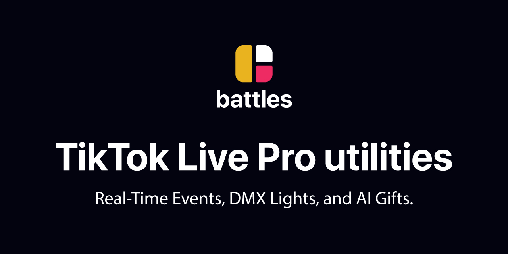

# 🎮 Battles.app Desktop
### Pro TikTok Live Utilities - Real-Time Animations, Light Shows, and AI

Download • [Beta Access](#beta-access-section) • [Documentation](#) • [Support](#)

---

<a href="https://github.com/battles-app/desktop/releases/download/v0.0.75/battles.app_0.0.75_x64-setup.exe" style="text-decoration:none;">
  

    Download Battles.app Desktop
  

</a>

Quick Start • System Requirements • Installation • Use Cases • Beta Access • Auto-Updates • FAQ • License • Links

---

## Features

<table>
<tr>
<td>

🎮 **Elgato Stream Deck Integration**  
Full support with real-time updates and branded animations

🎭 **Real-Time Animations**  
Instant trigger for animations and sound effects

💡 **Interactive Light Shows**  
Synchronized effects for engaging performances

</td>
<td>

🤖 **AI-Powered Tools**  
Smart automation and AI features for pro streaming

🎨 **Beautiful UI**  
Modern, dark-themed interface with smooth gradients

🔄 **Auto-Updates**  
Automatic updates with cryptographic signature verification

</td>
</tr>
<tr>
<td colspan="2">

⚔️ **Battle Board**  
Global library of pre-configured animations and sounds

✨ **User FX Board**  
Custom effects and media management for personalization

</td>
</tr>
</table>

---

## Quick Start

1. Download the latest version from the [releases page](https://github.com/battles-app/desktop/releases).
2. Install Battles.app Desktop on your Windows 10/11 system.
3. Begin streaming with professional-grade effects and animations!

---

## System Requirements

| OS        | Processor         | RAM  | GPU      | Accessories       |
|-----------|-------------------|------|----------|-------------------|
| Windows 10/11 (64-bit) | Quad-core processor | 8 GB | DirectX 11 compatible | Elgato Stream Deck (optional) |

---

## Installation

<a href="https://github.com/battles-app/desktop/releases/download/v0.0.75/battles.app_0.0.75_x64-setup.exe" style="text-decoration:none;">
  

    Download Now
  

</a>

1. Click the download button above.
2. Run the `battles.app_0.0.75_x64-setup.exe` installer.
3. Follow the on-screen instructions to complete the installation.

---

## Use Cases

- TikTok Live streaming with professional effects
- Interactive audience engagement with instant FX
- Live performances with synchronized effects
- Professional content creation and stream automation

---

## Beta Access Section

To request beta access, please [submit a request](#). Beta users will receive:

- Early access to new features
- Exclusive support channels
- Opportunities to influence future development

---

## Auto-Updates Section

- [x] Automatic updates from GitHub releases
- [x] Cryptographic signature verification for security
- [x] Easy, one-click updates within the app

---

## FAQ Section

How do I request beta access?

Beta access can be requested by submitting a form [here](#). You'll be notified via email if selected.

Can I use Battles.app Desktop on multiple devices?

Yes, Battles.app Desktop supports installation on multiple devices, as long as each device meets the system requirements.

What are the system requirements for Battles.app Desktop?

Battles.app Desktop requires Windows 10/11 (64-bit), a quad-core processor, 8 GB RAM, DirectX 11 compatible GPU, and optionally, an Elgato Stream Deck for the full experience.

---

## License Section

Battles.app Desktop is licensed under BSL 1.1. It is free for non-production use, with the following conditions:

- [x] Personal use
- [x] Development
- [x] Non-commercial testing

For production or commercial use:

- [ ] A commercial license is required.
- [x] Contact us for commercial licensing.

---

## Links Section

- [Download](https://github.com/battles-app/desktop/releases/download/v0.0.75/battles.app_0.0.75_x64-setup.exe)
- [Documentation](#)
- [Support](#)
- [Beta Access Request](#)

---

Made with ❤️  
Copyright © 2023 Battles.app  
Download • [Beta Access](#beta-access-section) • [Documentation](#) • [Support](#)

