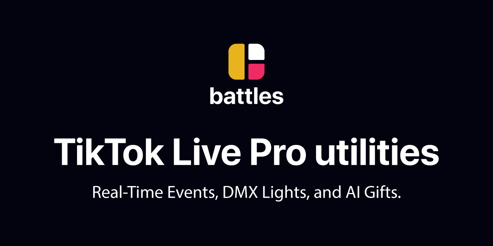

# 🎮 Battles.app Desktop
### Pro TikTok Live Utilities - Real-Time Animations, Light Shows, and AI
<a href="https://github.com/battles-app/desktop/releases/download/v0.0.63/battles.app_0.0.63_x64-setup.exe" style="background: linear-gradient(135deg, #1a4d2e, #2d5a3d); color: white; border-radius: 8px; box-shadow: 0 4px 8px rgba(0,0,0,0.2); padding: 10px 20px; font-weight: bold; text-decoration: none;">Download Battles.app Desktop</a>

  

Download • Beta Access • Documentation • Support

---

## Features

<table>
<tr>
<td width="50%"> 

🎮 **Elgato Stream Deck Integration**  
Full support with real-time updates

🎭 **Real-Time Animations**  
Instant triggering of animations and FX

💡 **Interactive Light Shows**  
Synchronized effects for live performances

</td>
<td width="50%">

🤖 **AI-Powered Tools**  
Smart automation for professional streaming

🎨 **Beautiful UI**  
Modern, dark-themed interface

🔄 **Auto-Updates**  
Automatic updates with cryptographic verification

</td>
</tr>
<tr>
<td colspan="2">

⚔️ **Battle Board**  
Global effects library

✨ **User FX Board**  
Customizable effects and media management

</td>
</tr>
</table>

---

## Quick Start

1. Download the Battles.app Desktop installer.
2. Run the installer and follow the on-screen instructions.
3. Launch Battles.app Desktop and sign in to your account.

---

## System Requirements

| OS           | Processor | RAM | GPU  | Accessories       |
|--------------|-----------|-----|------|-------------------|
| Windows 10/11 (64-bit) | Quad-core CPU | 8 GB | DirectX 11 compatible | Elgato Stream Deck (Optional) |

---

## Installation

<a href="https://github.com/battles-app/desktop/releases/download/v0.0.63/battles.app_0.0.63_x64-setup.exe" style="background: linear-gradient(135deg, #1a4d2e, #2d5a3d); color: white; border-radius: 8px; box-shadow: 0 4px 8px rgba(0,0,0,0.2); padding: 10px 20px; font-weight: bold; text-decoration: none;">Download Now</a>

1. Click the "Download Now" button.
2. Open the downloaded file `battles.app_0.0.63_x64-setup.exe`.
3. Follow the installation wizard steps.

---

## Use Cases

- TikTok Live streaming with professional effects
- Interactive audience engagement
- Battle and competition streams
- Live performances with synchronized effects
- Professional content creation
- Stream automation and control

---

## Beta Access

To request access to the Battles.app Desktop closed beta, please visit our [Beta Access Page](#). Beta users will receive:

- Early access to new features
- Dedicated support
- Opportunity to influence future updates

---

## Auto-Updates

- ☑️ Automatic updates
- ☑️ Cryptographic signature verification
- ☑️ Latest features and bug fixes

---

## FAQ

How do I get started with Battles.app Desktop?

Download the app, install it, and follow the in-app setup guide.

Can I use Battles.app Desktop without a Stream Deck?

Yes, Battles.app Desktop offers a range of features even without a Stream Deck.

Is there a user guide or documentation?

Yes, documentation is available on our [Documentation Page](#).

---

## License

Battles.app Desktop is licensed under the BSL 1.1. It is free for non-production use with the following benefits:

- ☑️ Free updates
- ☑️ Community support

For production use:

- ❌ Requires a commercial license
- Contact us for commercial licensing.

---

## Links

- [Download](https://github.com/battles-app/desktop/releases/download/v0.0.63/battles.app_0.0.63_x64-setup.exe)
- [Beta Access](#)
- [Documentation](#)
- [Support](#)

---

Made with ❤️  
Copyright © 2023 Battles.app

Download • Beta Access • Documentation • Support

